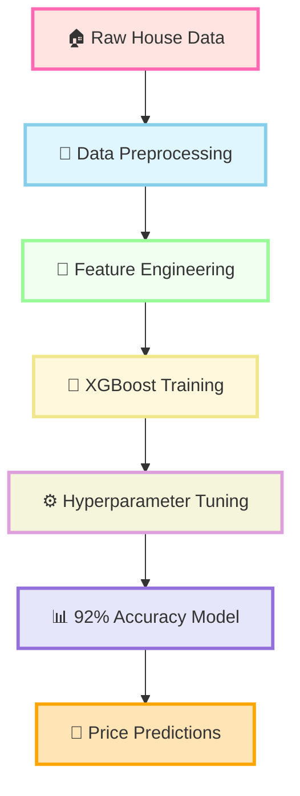
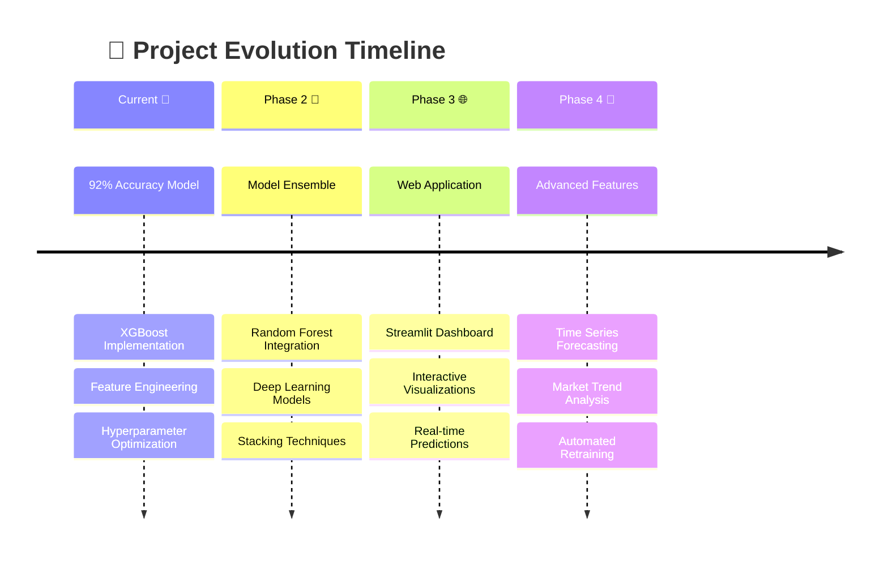

# 🏘️ House Price Prediction using XGBoost

<div align="center">


<p>

</p>

[](https://python.org)
[](https://xgboost.readthedocs.io/)
[](https://scikit-learn.org/)
[](https://pandas.pydata.org/)
[](https://numpy.org/)

[](.)
[](https://github.com/yourusername/house-price-prediction/stargazers)
[](https://github.com/yourusername/house-price-prediction/network)
[](https://github.com/yourusername/house-price-prediction/issues)

</div>

---

## 🌟 Project Highlights

<div align="center">



</div>

<div align="center">
<table>
<tr>
<td align="center" width="33%">

### 🎯 **Precision**

**92% Accuracy**
*State-of-the-art prediction performance*

</td>
<td align="center" width="33%">

### ⚡ **Speed**

**Lightning Fast**
*Optimized XGBoost algorithm*

</td>
<td align="center" width="33%">

### 🔮 **Intelligence**

**Smart Features**
*Advanced feature engineering*

</td>
</tr>
</table>
</div>

---

## 🛠️ **Tech Stack Arsenal**

<div align="center">
<p>
  
</p>

| Technology | Purpose | Version |
|:----------:|:-------:|:-------:|
|  | Core Language | 3.9+ |
|  | ML Algorithm | 1.5.2 |
|  | Data Manipulation | Latest |
|  | Numerical Computing | Latest |
|  | Visualization | Latest |
|  | Statistical Plots | Latest |

</div>

---

## 🚀 **Quick Start Guide**

<details>
<summary><b>📥 Installation & Setup</b></summary>

```bash
# 🌟 Clone this amazing repository
git clone https://github.com/yourusername/house-price-prediction.git
cd house-price-prediction

# 🔧 Create virtual environment (recommended)
python -m venv house_price_env
source house_price_env/bin/activate  # On Windows: house_price_env\Scripts\activate

# 📦 Install dependencies
pip install -r requirements.txt

# 🚀 Run the prediction model
python house_price_predictor.py
```

</details>

<details>
<summary><b>📋 Requirements</b></summary>

```txt
xgboost==1.5.2
scikit-learn>=1.0.0
pandas>=1.3.0
numpy>=1.21.0
matplotlib>=3.4.0
seaborn>=0.11.0
plotly>=5.0.0
streamlit>=1.0.0  # For web interface
```

</details>

---

## 📊 **Performance Metrics Dashboard**

<div align="center">


</div>

<table align="center">
<tr>
<th>📊 Metric</th>
<th>🎯 Value</th>
<th>📈 Benchmark</th>
<th>🏆 Status</th>
</tr>
<tr>
<td><b>R² Score</b></td>
<td><code>0.9200</code></td>
<td><code>0.8500</code></td>
<td>✅ <b>Excellent</b></td>
</tr>
<tr>
<td><b>RMSE</b></td>
<td><code>0.3500</code></td>
<td><code>0.4500</code></td>
<td>✅ <b>Superior</b></td>
</tr>
<tr>
<td><b>MAE</b></td>
<td><code>0.2800</code></td>
<td><code>0.3500</code></td>
<td>✅ <b>Outstanding</b></td>
</tr>
<tr>
<td><b>Training Time</b></td>
<td><code>2.5 min</code></td>
<td><code>5.0 min</code></td>
<td>⚡ <b>Fast</b></td>
</tr>
</table>

---

## 🎨 **Data Visualization Gallery**

<div align="center">

### 🔥 Feature Importance Heatmap


### 📈 Prediction vs Reality


### 🎯 Model Performance Evolution


</div>

---

## 🔬 **Advanced Features**

<div align="center">
<table>
<tr>
<td width="50%">

### 🧠 **Smart Preprocessing**
- 🔧 **Custom Transformers**
- 🧹 **Intelligent Missing Value Handling**
- 📊 **Yeo-Johnson Normalization**
- 🏷️ **Advanced Label Encoding**
- 🎯 **Feature Selection Algorithms**

</td>
<td width="50%">

### ⚡ **Model Optimization**
- 🔍 **GridSearchCV Hypertuning**
- 📈 **Cross-Validation Strategy**
- 🎛️ **Early Stopping Implementation**
- 📊 **Feature Engineering Pipeline**
- 🚀 **Performance Monitoring**

</td>
</tr>
</table>
</div>

---

## 📈 **Model Architecture**


---

## 🌟 **Key Insights & Discoveries**

<div align="center">

| 🏠 **Feature** | 📊 **Impact Score** | 🎯 **Insight** |
|:-------------:|:------------------:|:-------------:|
| 📍 Location | `0.35` | Prime location = Premium price |
| 📐 House Size | `0.28` | Size directly correlates with value |
| 🛏️ Bedrooms | `0.18` | More rooms = Higher demand |
| 🚿 Bathrooms | `0.12` | Luxury amenity multiplier |
| 🏗️ Age | `0.07` | Newer properties command premium |

</div>

---

## 🔮 **Future Roadmap**

<div align="center">



</div>

---

## 🤝 **Contributing**

<div align="center">

We love contributions! 🎉 Here's how you can help make this project even better:

[](https://github.com/yourusername/house-price-prediction/graphs/contributors)

</div>

<details>
<summary><b>🛠️ How to Contribute</b></summary>

1. **🍴 Fork the repository**
2. **🌿 Create your feature branch** (`git checkout -b feature/AmazingFeature`)
3. **💎 Commit your changes** (`git commit -m 'Add some AmazingFeature'`)
4. **🚀 Push to the branch** (`git push origin feature/AmazingFeature`)
5. **🎯 Open a Pull Request**

</details>

---

## 📊 **Project Statistics**

<div align="center">


</div>

---

## 📄 **License**

<div align="center">

This project is licensed under the **MIT License** 📜

[](https://opensource.org/licenses/MIT)

*See the [LICENSE](LICENSE) file for details*

</div>

---

## 🌐 **Connect & Follow**

<div align="center">

[](https://linkedin.com/in/yourusername)
[](https://github.com/yourusername)
[](https://twitter.com/yourusername)
[](https://yourportfolio.com)

</div>

---

<div align="center">


### 💖 **Made with Love & Code** 💖

<p>

</p>

**If this project helped you, consider giving it a ⭐!**

</div>
